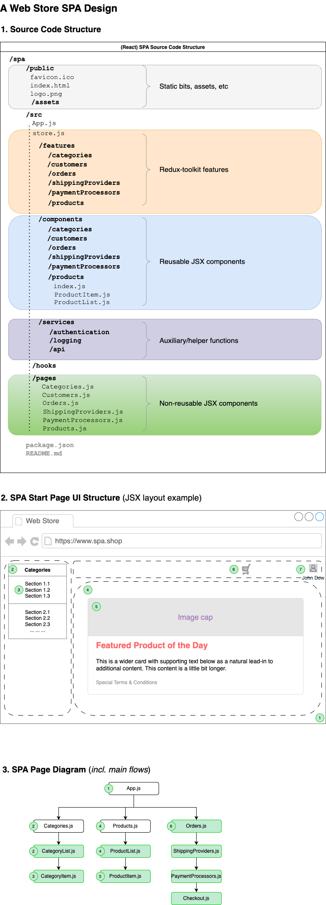

## Web Shop PoC and Notes

> The overall folder tree structure diagram (scroll down for further notes and comments).

### 1. Source Code Structure

The Client-side part of Storefront is to be implemented using 
[ReactJS library (v.18)](https://github.com/facebook/react/tree/main) coupled with 
[Redux-toolkit](https://www.npmjs.com/package/@reduxjs/toolkit) and [React-RxJS](https://react-rxjs.org/).
The former is a recommended SPA state management option (optimised for development _Redux design pattern_ implementation), 
and the latter is an optimal way to get APIs integrated with one's SPA (built-in _Observer design pattern_ 
plus loads of other useful thingies).

The overall SPA folder tree structure (Section 1 of the Diagram above) is designed __by type__, where there's
a distinct separation of reusable components (__components__ folder) from presentational (__pages__ folder) components,
which are roughly representing Web Store sections or uppermost navigation. Noteworthy, it is recommended to
follow __barrel file__ pattern while crafting reusable JSX components, i.e. adding *index.js* files on per folder
bases to facilitate importing components throughout the whole project.

__Redux design pattern__ relies on so-called slices, which belong to features of a given SPA, that's why initial
feature sub-folder set sticks to global navigation pattern, i.e. it follows main section list of the SPA.

__Services__ are separated and grouped __by purpose__ because of their injectable nature.

Usually, any large-scale application requires many custom **hooks**, which should be also available at any
place of the SPA. __Hooks pattern__ to rescue!

### 2. SPA UI Design

**Container/Presentational** pattern is natural UI design pattern in React; f.i. it's usual to *map*
a set of data in one component, using an imported component as a wrapper for each iterated element.

**Higher-Order Component** pattern allows to keep logic for further reuse; it happens when a JSX component
receives another one as props.

__Provider pattern__, which is associagted with _Context API_ in React world, ensures injectability to avoid
such unpleasant things like, for example, __props drilling__, and share the state(s) across the SPA seamlessly.

### 3. Toolkit in Use

A very important note must be given here on the developer's toolkit for any SPA in question. In the Section 3
of the Diagram it is presented a simplified flows to be implemented on the SPA public side. It is seen
all components presented has *.js* extensions, which is normal for a React project today. However, enterprise
level of development, where there are many teams working in parallel, requires more discipline and focus in the
course of development. The best option nowadays remains _Typescript_ for this. Apart from eliminating use of
such helpers designed specifically for React like *prop-types*, Typescript (plus, *Webpack*) forces developers 
to use certain design patterns and best practices at the development stage.